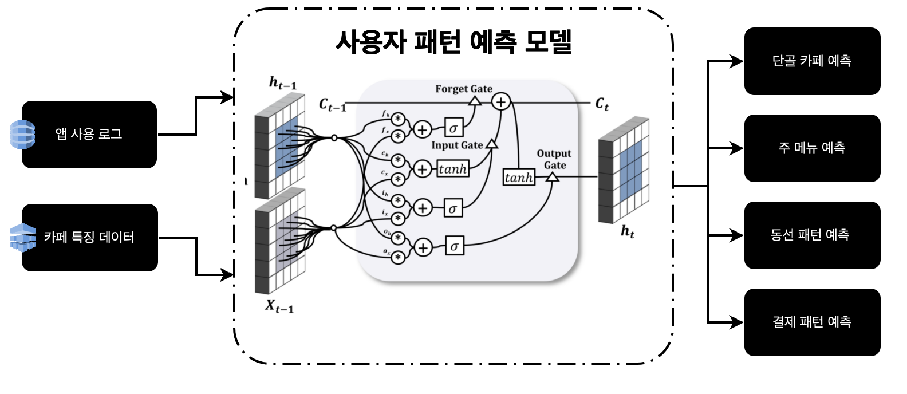

# A-MAZE: 사용자 패턴 예측 AI
- 카페 내 현황을 분석해 생성한 빅데이터와 고객 UI/UX 빅데이터로 미래의 특성 예측하는 AI모델입니다.
- 모든 개별 카페와 고객에 대해 예측 모델을 훈련/검증하는 과정을 거쳤습니다.
- 자사의 사용자 패턴 예측 AI 모델은 단골카페, 주메뉴, 동선 및 결제패턴 총 4개의 예측을 수행합니다.

## 하드웨어 사양
| 품목 | 규격 |
|------|------|
|CPU|Intel CPU Core I9-10920X|
|M/B| ASUS WS X299 SAGE|
|RAM | Samsung DDR4 16GB PC4-25600|
|SSD|SK Hynix Gold P31 M.2 NVMe (1TB)|
|VGA|GFORCE RTX3080Ti D6X 12GB Ref X4|

## 소프트웨어 환경
Server : Ubuntu 20.04 x86_64  
Database : MongoDB

## 소프트웨어 환경 설치
### 개발에 필요한 기본 패키지 설치
```shell
$ sudo apt-get update
$ sudo apt-get upgrade
$ sudo apt-get install vim nano build-essential zlib1g-dev libncurses5-dev libgdbm-dev libnss3-dev libssl-dev libreadline-dev libffi-dev wget gcc make python3-pip

```
### 그래픽카드 드라이버 설치
1. GPU와 호환되는 ubuntu diriver를 설치한다.
    ```shell 
    $ ubuntu-drivers devices
    ```
2. 설치 가능한 드라이버 리스트를 확인한다.
    ```shell 
    $ apt-cache search nvidia | grep nvidia-driver-{version}
    ```
3. 해당 저장소 추가하고, 패키지 매니저를 업데이트한다.
    ```shell 
    $ sudo add-apt-repository ppa:graphics-drivers/ppa
    $ sudo apt update
    ``` 
4. 해당 명령어로 설치된 드라이버를 확인한다.
    ```shell
    $ nvidia-smi
    ```

### CUDA 설치하기
1. cuda toolkit을 설치한다.  
    ###### CUDA toolkit 12.0.0 /Linux / x86_64 / Ubuntu20.04 기준
    ```shell
    $ wget https://developer.download.nvidia.com/compute/cuda/repos/ubuntu2004/x86_64/cuda-keyring_1.0-1_all.deb
    $ sudo dpkg -i cuda-keyring_1.0-1_all.deb
    $ sudo apt-get update
    $ sudo apt-get -y install cuda
    ```
    다른 환경에 대한 설치방법은 [해당 링크](https://developer.nvidia.com/cuda-12-0-0-download-archive) 참조할 것.

### CUDA 환경 설정
1. 아래 명령어로 설정파일을 연다.
    ```shell
    $ vim /etc/profile
    ```
2. 아래와 같은 명령어를 입력한다.
    ```shell
    $ export PATH=/usr/local/cuda-12.0/bin${PATH:+:${PATH}}
    $export LD_LIBRARY_PATH=/usr/local/cuda-12.0/lib64${LD_LIBRARY_PATH:+:${LD_LIBRARY_PATH}}
    $ export LD_LIBRARY_PATH=/usr/local/cuda-12.0/extras/CUPTI/lib64${LD_LIBRARY_PATH:+:${LD_LIBRARY_PATH}}
    ```
3. 설정 파일을 적용한다.
    ```shell
    $ source /etc/profile
    ```
#### cuDNN 설치하기  
1. [해당링크](https://developer.nvidia.com/rdp/cudnn-archive) 에서 CUDA 버전 및 서버 환경과 맞는 파일 다운로드 
2. 압축을 풀고 설치한다.
    ```shell
    $ unxz cudnn-linux-x86_64-8.7.0.84_cuda12-archive.tar.xz
    $ tar -xvf cudnn-linux-x86_64-8.7.0.84_cuda12-archive.tar

    $ sudo cp cudnn-linux-x86_64-8.7.0.84_cuda12-archive/include/* /usr/local/cuda-12/include
    $ sudo cp -P cudnn-linux-x86_64-8.7.0.84_cuda12-archive/lib/* /usr/local/cuda-12/lib64
    $ sudo chmod a+r /usr/local/cuda-12/lib64/libcudnn*

    $ cat /usr/local/cuda/include/cudnn_version.h | grep CUDNN_MAJOR -A 2
    ```

### Python 3.12 설치하기
```shell
$ tar -xvf Python-3.12.0a5.tar.xz
$ cd Python-3.12.0a5
$ ./configure --enable-optimizations
$ make -j 4
$ sudo make altinstall
$ sudo apt-get install python3-pip
```


#### Anaconda 설치하기 
1. [해당링크](https://repo.anaconda.com/archive/)에서 환경에 맞는 최신 버전을 다운로드한다.
    ```shell
    $ wget https://repo.anaconda.com/archive/Anaconda3-2023.07-2-Linux-x86_64.sh
    $ sudo bash Anaconda3-2021.05-Linux-x86_64.sh
    ```
2. Anaconda를 초기 설정을 활성화한다.
    ```shell
    $ source /usr/anaconda3/bin/activate 
    $ conda init
    $ source ~/.bashrc
    ```

### 기타 패키지 설치하기
아래 명령어를 통해 프로그램 실행에 필요한 파이썬 패키지 목록을 설치한다.
```shell
$ sudo pip3 install -r requirements.txt
```

## 사용자 패턴 예측 4개의 모델

아래 4개의 모델 모두 사용자의 A-MAZE 앱 사용 로그를 기반으로 예측하는 ConvLSTM모델입니다.  
사용자의 단순 앱 사용 로그 뿐만 아니라, 메뉴의 이미지, 카페의 위치 등 종합적인 맥락을 고려하기 위해 ConvLSTM을 사용하였습니다.

### 단골 카페 예측 모델
  
단골 카페 예측 모델은 사용자의 요일 별 카페 방문 데이터를 분석하고, 자주 방문한 카페의 특징 데이터를 기반으로 어떤 요일에 어떤 카페를 주로 가는지 예측하는 모델입니다.


### 주메뉴 예측 모델
  
주메뉴 예측 모델의 사용자가 특정 카페에서 요일 별로 자주 주문하는 메뉴의 특징을 분석해서, 다음에 어떤 메뉴를 주문할지 예측하는 모델입니다.  
사용자가 선호하는 메뉴를 상위 3개까지 선별하여 가중치를 부여합니다.


### 동선 패턴 예측 모델
  
동선 패턴 예측 모델은 자사의 모델 중 하나인 단골 카페 예측 모델 결과를 기반으로, 사용자의 위치 및 시간대 별 주문 패턴을 분석해서 특정 시간, 특정 위치에서 사용자가 어떤 카페에 방문할지 예측하는 모델입니다.


### 결제 패턴 예측 모델
  
결제 패턴 예측 모델은 사용자의 일자 별, 요일 별, 월 별 결제 빈도 및 금액 데이터를 기반으로 언제, 얼만큼의 금액을 사용할지 예측하는 모델입니다.


##### A-MAZE 앱 내 AI 진단 페이지


